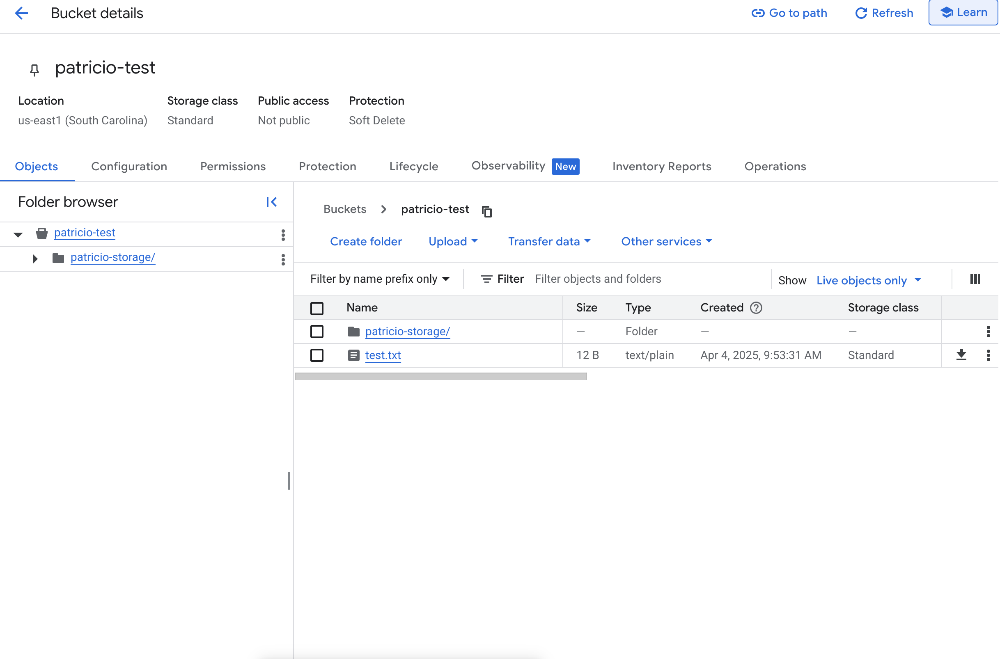

# Helm setup and backup test


Now that you have storage, service account and key the next step is to configure your helm values and run your backup. So far this backup guide is only for Zeebe. Operate/Tasklist/Optimize are still pending.


# 1. Zeebe

## Configuration

1.1 In the Helm chart , in the Zeebe section, add this information
```yaml
zeebe:
  env:
    - name: ZEEBE_BROKER_DATA_BACKUP_GCS_BUCKETNAME
      value: "storage_name"
    - name: ZEEBE_BROKER_DATA_BACKUP_GCS_BASEPATH
      value: "some_directory_name"
    - name: ZEEBE_BROKER_DATA_BACKUP_STORE
      value: "GCS"
    - name: GOOGLE_APPLICATION_CREDENTIALS
      value: /var/secrets/gcp/key.json

  extraVolumes:
    - name: gcp-credentials
      secret:
        secretName: gcp-credentials

  extraVolumeMounts:
    - name: gcp-credentials
      mountPath: /var/secrets/gcp
      readOnly: true
````      

> Note: the access key is created in the connection document


The google `basepath` is the container name. Zeebe will create snapshots on that repository. It is not possible to give a path to the value, and the data will be stored at the root level.

1.2

Create a Kubernetes secret that will be used by Camunda.

kubectl create secret generic gcp-credentials --from-literal "key.json=$(cat key.json)" -n camunda

1.3 Restart the cluster

Run the command
```shell
helm upgrade --namespace camunda camunda camunda/camunda-platform -f <MyValue.yaml>
```


## Test

Run a backup on Zeebe directly. See the documentation
https://docs.camunda.io/docs/self-managed/zeebe-deployment/operations/management-api/

1.3 Port-forward the server
```shell
kubectl port-forward svc/camunda-zeebe-gateway 9600:9600 -n camunda
```
1.4 Pause the exporting

```shell
curl -X POST "http://localhost:9600/actuator/exporting/pause"   -H 'Content-Type: application/json'    -d '{}'
```

1.5 Execute a backup

```shell
curl -X POST "http://localhost:9600/actuator/backups"  -H 'Content-Type: application/json'  -d "{\"backupId\": \"8\"}"
```
1.6 Monitor the backup
```shell
curl -s "http://localhost:9600/actuator/backups/8"
```

1.7 Resume Zeebe

```shell
curl -X POST "http://localhost:9600/actuator/exporting/resume"  -H 'Content-Type: application/json'    -d '{}'
```


1.8 Check the container

Some files must be visible on the storage



Under folder 1, a folder 8 is visible (8 is the backup ID)
