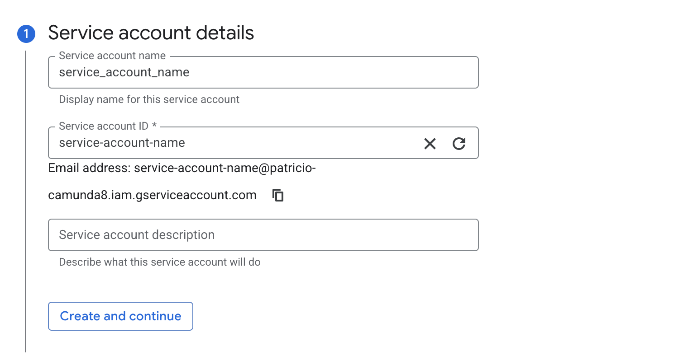
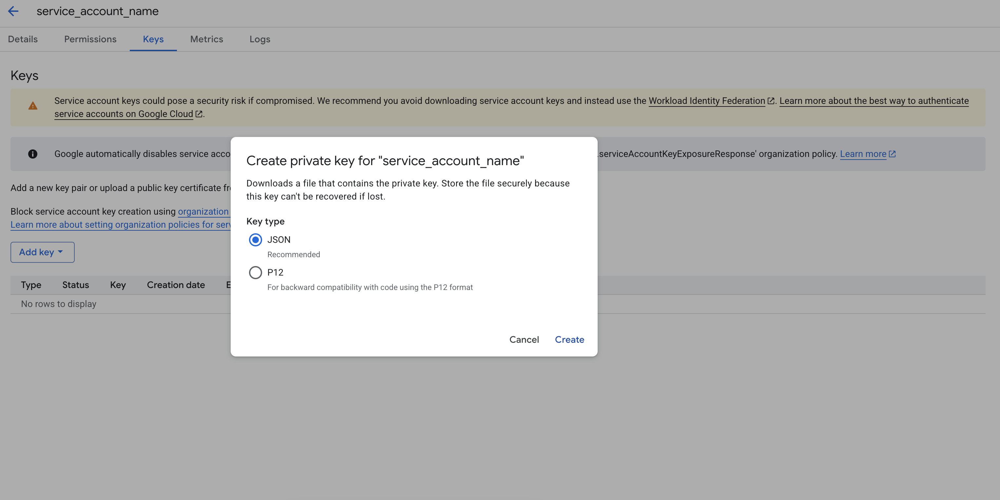

# Connection

It is required to have a service account in order to have your cluster and Camunda 8 components connect to the Google storage bucket. Follow the next steps to create a service account and download the key.

1. Connect to Google Cloud Console and go to Service Accounts IAM&Admin.

2. Click on Create

3. Fill out the service account name (`patricio-service-account`) with your preference and add a description (optional). Then click create and continue.

4. Add the `Storage admin` role (or the specific role that you might need to create/delete objects in a bucket) to the service account as per the below.

5. Click Done.

6. Go to the view that shows all of the service accounts and click on your recently created service account.

7. Click on the link of the new service account created

7. Go to the Keys tab.

8. Click on add new key --> create new key and select JSON.  Download the key and store it in a safe place. This is the key that Camunda will use to gain access to your storage bucket via such service account.

9. Add this service account to the bucket
Open your bucket

10. Go to Cloud Console → Cloud Storage → Buckets

Click on the bucket you created.

11. Manage permissions

Inside the bucket, go to the Permissions tab.

Click + Grant Access.

13. Add your service account

In the New principals field, enter your service account email, for example (`patricio-service-account@patricio-camunda8.iam.gserviceaccount.com`)

14. In the Select a role dropdown, choose a storage role: `Storage admin`

15. Save

Click Save.

Your service account is now linked to the bucket with the chosen permissions.
