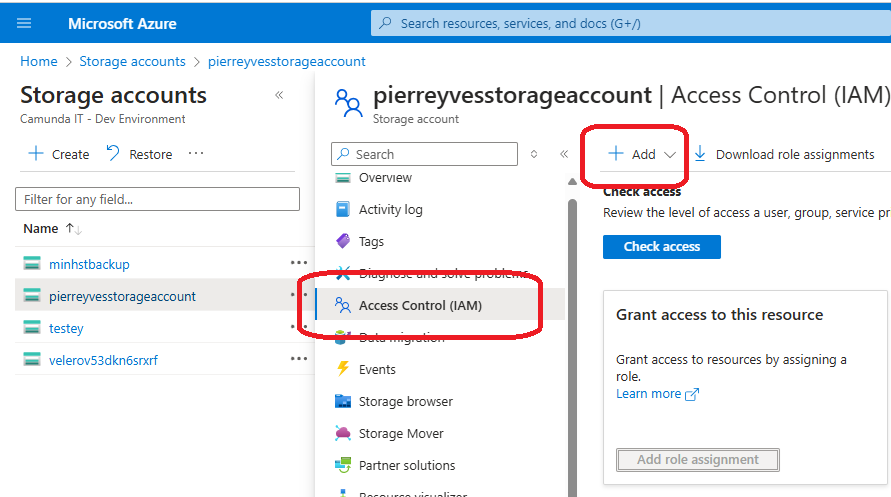

# Connection via IAM Policy

Create an Azure Managed Identity (if needed):

If you're using a service or virtual machine, create a Managed Identity for the resource. This provides an identity to access Azure resources securely without needing to manage credentials.
Assign a Role to the Managed Identity:


# IAM access control

Create an IAM role
On the storage account, access the `Access Control IAM` 



Under Access Control (IAM), click Add and assign the appropriate role. 
`Storage Blob Data Reader`, `Storage Blob Data Contributor` are necessary for the pod to create a backup

> Note: TO be done


# Configure the Storage Account to Use Azure AD Authentication
 
 

Ensure that your storage account is configured to use Azure AD authentication. This can be done in the Azure portal under 
Storage Account -> Access control (IAM).

> Note : does this step is mandatory? To be describe

Use Azure SDK or Azure CLI:


az storage blob list --account-name <your_storage_account_name> --container-name <your_container_name> --auth-mode login
This will use your Azure AD credentials (or the Managed Identity) to access the Azure Storage account instead of a security key.

# Install Azure Identity for Kubernetes (AAD Pod Identity)
https://learn.microsoft.com/en-us/azure/aks/use-azure-ad-pod-identity


#  Create Azure Identity and Bind It to Kubernetes Service Account
You need to create two resources in Kubernetes:

* AzureIdentity: This represents the Managed Identity in Azure.
* AzureIdentityBinding: This binds the Azure Managed Identity to a Kubernetes service account.

AzureIdentity:
````yaml
apiVersion: aadpodidentity.k8s.io/v1
kind: AzureIdentity
metadata:
  name: AzureContainerIdentityName
spec:
  type: UserAssigned
  userAssignedID: /subscriptions/<subscription-id>/resourceGroups/<resource-group-name>/providers/Microsoft.ManagedIdentity/userAssignedIdentities/<managed-identity-name>
  clientID: <managed-identity-client-id>

````

AzureIdentityBinding:
This links the AzureIdentity to your Kubernetes service account (named `AzureContainerAServiceAccount`)

```yaml
apiVersion: aadpodidentity.k8s.io/v1
kind: AzureIdentityBinding
metadata:
  name: AzureContainerIdentityBinding
spec:
  AzureIdentity: AzureContainerIdentityName
  selector: AzureContainerServiceAccount  # The service account that will use this binding

```

# Create the Kubernetes Service account

Note: the service account does not declare anything. The relation is created in the AzureIdentityBinding

**AzureServiceAccount.yaml**
```yaml
apiVersion: v1
kind: ServiceAccount
metadata:
  name: AzureContainerServiceAccount  # Name of your service account
```

Execute this command

```shell
kubectl apply -f AzureServiceAccount.yaml
```

Doing that, the service account is a defaut value for all pods in the cluster.

# Update Your Kubernetes Pod to Use the Service Account

This step is not mandatory, because the service is now by default on all pods. It's possible to register explicitaly it on Zeebe
 

```yaml
zeebe:
  serviceAccountName:
    broker: AzureContainerAServiceAccount
```

Doing that, 

1. The pod use the serviceAccountName `AzureContainerAServiceAccount`
2. The service account is bind via the `AzureContainerIdentityBinding` to the Identity Manager
3. The identity manager connect to Azure